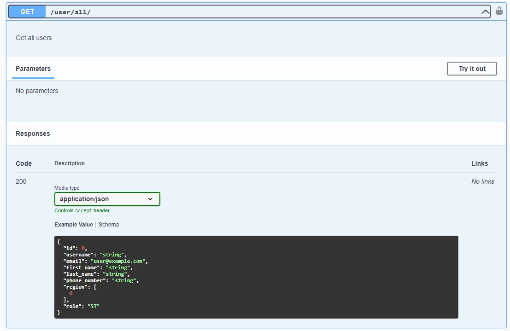
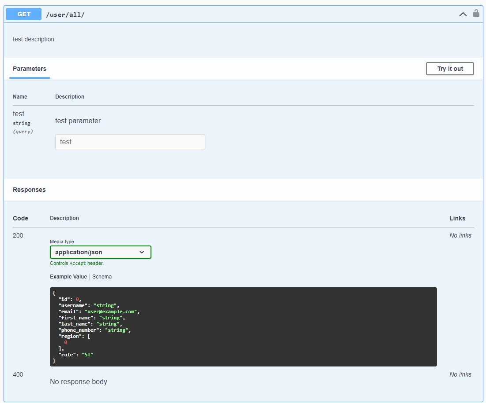

# API Documentation

We used [drf-spectacular](https://github.com/tfranzel/drf-spectacular#customization-by-using-extend_schema) to automatically
generate [OpenAPI 3.0/Swagger](https://spec.openapis.org/oas/v3.0.3) compliant documentation for our API. While it already
generates a lot out of the box, it will still be necessary to add some things ourselves.

## How to generate the schema (documentation)
Use the following command to generate a schema:
```bash
docker-compose exec backend python manage.py spectacular --file schema.yml
```
To access the documentation, head over to http://localhost:2002/api/schema/swagger-ui/.

Please note that generating the schema might output a lot of warnings and errors. In the next section we'll talk about to
fix the most common error, but I am unsure whether the warnings will cause any issues. I recommend to fix the errors first
to see if the result is already as desired, and if so, we can probably ignore the warnings.

## How to expand and edit the schema
The [@extend_schema](https://drf-spectacular.readthedocs.io/en/latest/drf_spectacular.html#drf_spectacular.utils.extend_schema)
decorator from [drf-spectacular](https://github.com/tfranzel/drf-spectacular#customization-by-using-extend_schema) will cover most if not all use cases for customizing the documentation. Below is an example
of how to use it:

```python
class AllUsersView(APIView):
    serializer_class = UserSerializer

    @extend_schema(
        parameters=[OpenApiParameter(name='test', description='test parameter', required=False, type=str)],
        description="test description",
        responses={200: UserSerializer,
                   400: None}
    )
    def get(self, request):
        """
        Get all users
        """

        user_instances = User.objects.all()

        if not user_instances:
            return Response(
                {"res": "No users found"},
                status=status.HTTP_400_BAD_REQUEST
            )

        serializer = UserSerializer(user_instances, many=True)
        return Response(serializer.data, status=status.HTTP_200_OK)
```

Before adding [@extend_schema](https://drf-spectacular.readthedocs.io/en/latest/drf_spectacular.html#drf_spectacular.utils.extend_schema),
the automatically generated documentation looks like this:


Since the request from the example is a `GET` request, automatically generating the 200 response code is not an issue,
however, it's still missing the 400 response code. To fix this, use [@extend_schema](https://drf-spectacular.readthedocs.io/en/latest/drf_spectacular.html#drf_spectacular.utils.extend_schema)
like in the example above. You'll have to define this right before any request function if you want to change or expand the
default documentation. The most common fields you'll need are also used in the example. Please note that even though the documentation
for the 200 response code has already been generated without [@extend_schema](https://drf-spectacular.readthedocs.io/en/latest/drf_spectacular.html#drf_spectacular.utils.extend_schema),
we'll still need to respecify it since using the `responses` field will override all old responses. The documentation for `/user/all` now looks like this:



Now note how we set `serializer_class = UserSerializer` without ever using `serializer_class`. This was necessary to fix
one of the errors we talked about earlier, more specifically the `unable to guess serializer` error. By adding this line
we'll be specifying a serializer which should fix the error. Without this line the documentation for `/user/all` will just
not appear at all.

Don't forget to generate a new `schema.yml` once you're done!

For another (bigger) example, click [here](https://github.com/tfranzel/drf-spectacular#usage). For the full documentation of
[drf-spectacular](https://github.com/tfranzel/drf-spectacular#customization-by-using-extend_schema), click
[here](https://drf-spectacular.readthedocs.io/en/latest/).
